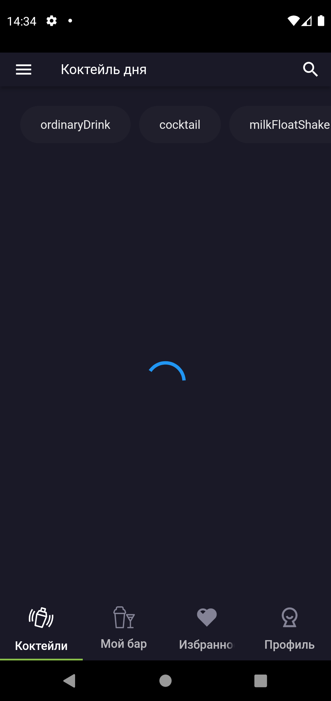

## Первая часть домашнего задания:
- [V] На следующих экранах перечислены несколько представлений тестового приложения:

- [V] RandomCoctailPage - lib/ui/pages/random_cocktail_page.dart

- [V] FilterResultsPage - lib/ui/pages/filter_results_page.dart

- [V] CoctailDetailsPage - lib/ui/pages/details/cocktail_detail_page.dart

- [V] Переход к каждому экрану сопровождается показом виджета CircularProgressIndicator из Flutter SDK.

- [V] Этот виджет нужно реализовать самостоятельно, используя стандартные средства Flutter для работы с графическим canvas и средства анимации. И затем переиспользовать вместо CircularProgressIndicator  (в местах отмеченных///todo:)

- [V] Поведение индикатора описано здесь:
** https://material.io/components/progress-indicators#circular-progress-indicators

## Вторая часть домашнего задания:
- [ ] На каждом из экранов вы видите иконку для указания признака isFavorite (сердечко).
Этот код везде продублирован.

- [V] Необходимо этот код (он помечен в коде как ///todo:) отрефакторить в пользу отдельного виджета, который можно будет переиспользовать во всех местах - CocktailGridItem, CocktailTitle.

- [V] Новый виджет должен поддерживать два состояния - isFavorite, !isFavorite (иконка filled, outline).

- [V] Иконка должна быть отрисована с использованием графических примитивов - то есть использовать material icons нельзя, работаем через CustomPaint/ClipPath.

- [V] При нажатии иконка должна увеличиваться на 20 % и возвращаться в исходное состояние.

- [V] Можно добавить свою физику за счет Curves (ease, elastic, bounce).

