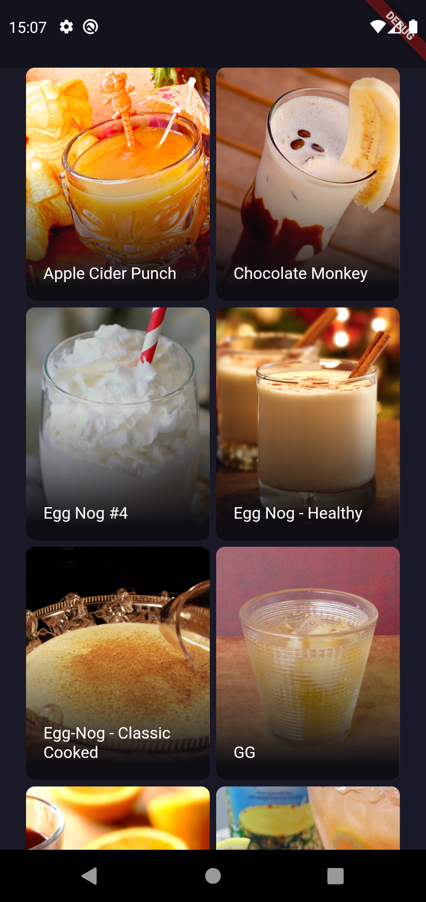
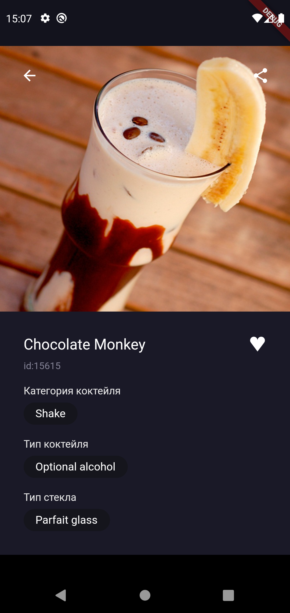

- Открыть класс экрана FavouriteCocktailsScreen

- Внести изменения в код экрана, выделив соотвествующие обработчики событий на нажатие элемента из списка избранных коктейлей

- В обработчике события на переход к экрану описания коктейля выполнить асинхронное получение модели коктейля

- В обработчике события на переход к экрану описания коктейля после получения модели коктейля выполнить навигацию к экрану описания коктейля (CocktailDetailsScreen) с передачей полученной модели

- Убедиться, что CocktailDetailsScreen отображает корректно полученную модель

